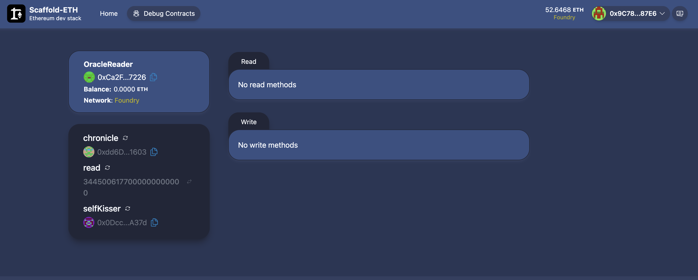

# 🏗 OracleReader Built on Scaffold-ETH 2


🧪 An open-source, toolkit for building decentralized applications (dapps) on the Ethereum blockchain and integrating with Chronicle Oracles. It's designed to make it easier for developers to create and deploy smart contracts and build user interfaces that interact with those contracts.

⚙️ Built using NextJS, RainbowKit, Foundry, Wagmi, Viem, and Typescript.

- ✅ **Contract Hot Reload**: Your frontend auto-adapts to your smart contract as you edit it.
- 🪝 **[Custom hooks](https://docs.scaffoldeth.io/hooks/)**: Collection of React hooks wrapper around [wagmi](https://wagmi.sh/) to simplify interactions with smart contracts with typescript autocompletion.
- 🧱 [**Components**](https://docs.scaffoldeth.io/components/): Collection of common web3 components to quickly build your frontend.
- 🔥 **Burner Wallet & Local Faucet**: Quickly test your application with a burner wallet and local faucet.
- 🔐 **Integration with Wallet Providers**: Connect to different wallet providers and interact with the Ethereum network.




## Requirements

Before you begin, you need to install the following tools:

- [Node (>= v18.17)](https://nodejs.org/en/download/)
- Yarn ([v1](https://classic.yarnpkg.com/en/docs/install/) or [v2+](https://yarnpkg.com/getting-started/install))
- [Git](https://git-scm.com/downloads)

## 🏃🏻‍♂️ Running It 

To run this example, which uses the Foundry tooling in conjunction with [Scaffold-ETH2](https://scaffoldeth.io), you first need to fork the [Sepolia network](https://sepolia.etherscan.io/). 

In a terminal window install dependencies:

```
cd my-dapp-example
yarn install
```

Fork your target network, leave this terminal window open as it runs your local chain.

```
export ETH_RPC_URL='https://your-sepolia-rpc-server/etc'
yarn fork
```


In a second terminal window, you can now deploy your contracts to the local chain:

```
export DEPLOYER_PRIVATE_KEY="0xdeadbeefcafebabe"
cd packages/foundry
cp .env.example .env
yarn deploy
```

When this completes, you should see a contract address in the output:

```
...
##### sepolia
✅  [Success]Hash: 0xda5b4871929d1414a5b447769f4d8d757b1aea8e280555adb9dd7ec67bb6b683
Contract Address: 0xA2B4473120b9d18abfE90EEb2722A57CB72C4212
```

Now, you can verify that you can read with the Foundry `cast` command:

```
🦄 cast call 0xA2B4473120b9d18abfE90EEb2722A57CB72C4212 'read()(uint)'
3319415000000000000000 [3.319e21]
```

Note that because this is a fork of the Sepolia network, you should be getting a pretty up-to-date value for `ETH/USD`.


You can now start your NextJS app:

```
yarn start
```

Visit your app on: `http://localhost:3000`. You can interact with your smart contract using the `Debug Contracts` page. You can tweak the app config in `packages/nextjs/scaffold.config.ts`.

Run smart contract test with `yarn foundry:test`

- Edit your smart contract `YourContract.sol` in `packages/foundry/contracts`
- Edit your frontend homepage at `packages/nextjs/app/page.tsx`. For guidance on [routing](https://nextjs.org/docs/app/building-your-application/routing/defining-routes) and configuring [pages/layouts](https://nextjs.org/docs/app/building-your-application/routing/pages-and-layouts) checkout the Next.js documentation.
- Edit your deployment scripts in `packages/foundry/script`
